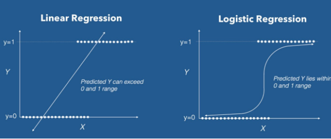
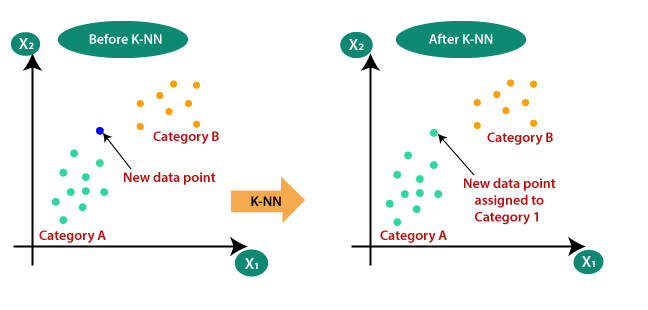
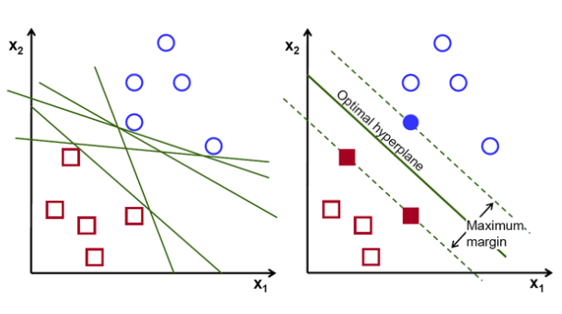
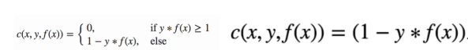
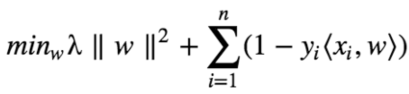
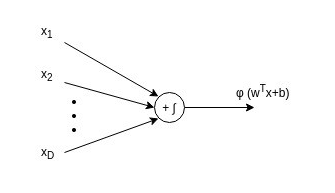
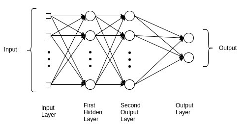
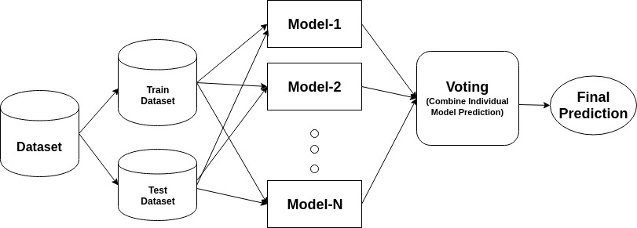

# Heart Risk Prediction using Machine Learning Algorithm
Today the heart disease is one of the most important causes of death in the world. So, its early prediction and diagnosis 
is important in medical field, which could help in on time treatment, decreasing health costs and decreasing death caused by 
it. In fact, the main goal of using data mining algorithms in medicine by using patients’ data is better utilizing the database
and discovering tacit knowledge to help doctors in better decision making. Therefore, using data mining and discovering knowledge 
in cardiovascular centres could create a valuable knowledge, which improves the quality of service provided by managers, and could 
be used by doctors to predict the future behaviour of heart diseases using past records. Also, some of the most important applications 
of data mining and knowledge discovery in heart patient’s system includes: diagnosing heart attack from various signs and properties, 
evaluating the risk factors which increases the heart attack. Here various type of Machine Learning Model were used. 

# Logistic Regression
Logistic Regression is a Machine Learning algorithm which is used for the classification problems, it is a predictive analysis algorithm and based on the concept of probability.

We can call a Logistic Regression a Linear Regression model but the Logistic Regression uses a
more complex cost function, this cost function can be defined as the Sigmoid Function knwon as
`logistic function' instead of a linear function. The hypothesis of logistic regression tends it to limit the cost function between 0 and 1. Therefore linear functions fail to represent it as it can have a value greater than 1 or less than 0 which
is not possible as per the hypothesis of logistic regression.  Refere 
##### Model/Log_regression.ipynb

# K-Neareat-Neighbor ML
K-Nearest Neighbor is one of the simplest Machine Learning algorithms based on Supervised
Learning technique-KNN algorithm assumes the similarity between the new case/data and avail-
able cases and put the new case into the category that is most similar to the available categories-
KNN algorithm stores all the available data and classies a new data point based on the sim-
ilarity. This means when new data appears then it can be easily classified into a well suite
category by using K- NN algorithm. K-NN algorithm can be used for Regression as well as for
Classification but mostly it is used for the Classification problems.
Suppose there are two categories, i.e., Category A and Category B, and we have a new data
point x1, so this data point will lie in which of these categories. To solve this type of problem,
we need a K-NN algorithm. With the help of K-NN, we can easily identify the category or class
of a particular dataset. Consider the below diagram:

* Step-1: Select the number K of the neighbors
* Step-2: Calculate the Euclidean distance of K number of neighbors
* Step-3: Take the K nearest neighbors as per the calculated Euclidean distance.
* Step-4: Among these k neighbors, count the number of the data points in each category.
* Step-5: Assign the new data points to that category for which the number of the neighbor is
maximum.
* Step-6: Our model is ready.

# Support Vector Machine 
The objective of the support vector machine algorithm is to nd a hyperplane in an N-dimensional
space(N | the number of features) that distinctly classies the data points.
To separate the two classes of data points, there are many possible hyperplanes that could be
chosen. Our objective is to nd a plane that has the maximum margin, i.e the maximum dis-
tance between data points of both classes.

In the SVM algorithm, we are looking to maximize the margin between the data points and the
hyperplane. The loss function that helps maximize the margin is hinge loss.

The cost is 0 if the predicted value and the actual value are of the same sign. If they are not,
we then calculate the loss value. We also add a regularization parameter the cost function. The
objective of the regularization parameter is to balance the margin maximization and loss. After
adding the regularization parameter, the cost functions looks as below.

Now that we have the loss function, we take partial derivatives with respect to the weights to
and the gradients. Using the gradients, we can update our weights.

# Multiple Perceptron (MLP)

 Perceptron Algorithm, in the perceptron we just multiply with weights and add Bias, but we do
this in one layer only.

We update the weight when we found an error in classication or miss-classied. Weight update
equation is this. . .
weight = weight + learningrate x (expected - predicted) x X

In the Multilayerperceptron; there can more than one linear layer(combinations of neurons):If we take the simple example the three
layer network;first layer will be the input layer and last will be output layer and middle layer will be called hidden layer: We feed our input data into the input layer

# Random Forest Machine Learning
Random forest, like its name implies, consists of a large number of individual decision trees that
operate as an ensemble. Each individual tree in the random forest spits out a class prediction
and the class with the most votes becomes our model's prediction
* Step 1 − First, start with the selection of random samples from a given dataset.
* Step 2 − Next, this algorithm will construct a decision tree for every sample. Then it will get the prediction result from every decision tree.
* Step 3 − In this step, voting will be performed for every predicted result.
* Step 4 − At last, select the most voted prediction result as the final prediction result.

# Ensemble Machine Learning (Adaboost and Gradient Boosting)

## AdaBoost (Adaptive Boosting)
AdaBoost is a boosting ensemble model and works especially well with the decision tree. Boosting model’s key is learning from the previous mistakes, e.g. misclassification data points.
AdaBoost learns from the mistakes by increasing the weight of misclassified data points.

* Step 0: Initialize the weights of data points. if the training set has 100 data points, then each point’s initial weight should be 1/100 = 0.01.
* Step 1: Train a decision tree
* Step 2: Calculate the weighted error rate (e) of the decision tree. The weighted error rate (e) is just how many wrong predictions out of total and you treat the wrong predictions differently based on its data point’s weight. The higher the weight, the more the corresponding error will be weighted during the calculation of the (e).
* Step 3: Calculate this decision tree’s weight in the ensemble
the weight of this tree = learning rate * log( (1 — e) / e)
the higher weighted error rate of a tree, the less decision power the tree will be given during the later voting
the lower weighted error rate of a tree, the higher decision power the tree will be given during the later voting
* Step 4: Update weights of wrongly classified points

## Gradient Boosting
Gradient boosting is another boosting model. Remember, boosting model’s key is learning from the previous mistakes.
Gradient Boosting learns from the mistake — residual error directly, rather than update the weights of data points.
* Step 1: Train a decision tree
* Step 2: Apply the decision tree just trained to predict
* Step 3: Calculate the residual of this decision tree, Save residual errors as the new y
* Step 4: Repeat Step 1 (until the number of trees we set to train is reached)
* Step 5: Make the final prediction

# Model Performance Parameters
### The Confusion matrix 
Confusion Matrix is one of the most intuitive and easiest (unless of course, you are not confused)metrics used for finding the correctness and accuracy of the model. It is used for Classification problem where the output can be of two or more types of classes.
True Positives (TP): True positives are the cases when the actual class of the data point was 1(True) and the predicted is also 1(True)
Ex: The case where a person is actually having cancer(1) and the model classifying his case as cancer(1) comes under True positive.
2. True Negatives (TN): True negatives are the cases when the actual class of the data point was 0(False) and the predicted is also 0(False
Ex: The case where a person NOT having cancer and the model classifying his case as Not cancer comes under True Negatives.
3. False Positives (FP): False positives are the cases when the actual class of the data point was 0(False) and the predicted is 1(True). False is because the model has predicted incorrectly and positive because the class predicted was a positive one. (1)
Ex: A person NOT having cancer and the model classifying his case as cancer comes under False Positives.
4. False Negatives (FN): False negatives are the cases when the actual class of the data point was 1(True) and the predicted is 0(False). False is because the model has predicted incorrectly and negative because the class predicted was a negative one. (0)
Ex: A person having cancer and the model classifying his case as No-cancer comes under False Negatives.

### Accuracy: 
Accuracy in classification problems is the number of correct predictions made by the model over all kinds predictions made.

In the Numerator, are our correct predictions (True positives and True Negatives)(Marked as red in the fig above) and in the denominator, are the kind of all predictions made by the algorithm(Right as well as wrong ones).

#### Precision
Precision is a measure that tells us what proportion of patients that we diagnosed as having cancer, actually had cancer. The predicted positives (People predicted as cancerous are TP and FP) and the people actually having a cancer are TP.

#### Recall (Sensitivity)
Recall is a measure that tells us what proportion of patients that actually had cancer was diagnosed by the algorithm as having cancer. The actual positives (People having cancer are TP and FN) and the people diagnosed by the model having a cancer are TP. (Note: FN is included because the Person actually had a cancer even though the model predicted otherwise).

#### F1 Score
The F1 Score is the 2*((precision*recall)/(precision+recall)). It is also called the F Score or the F Measure. Put another way, the F1 score conveys the balance between the precision and the recall.

